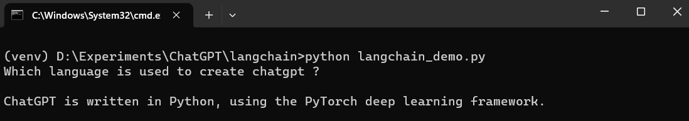
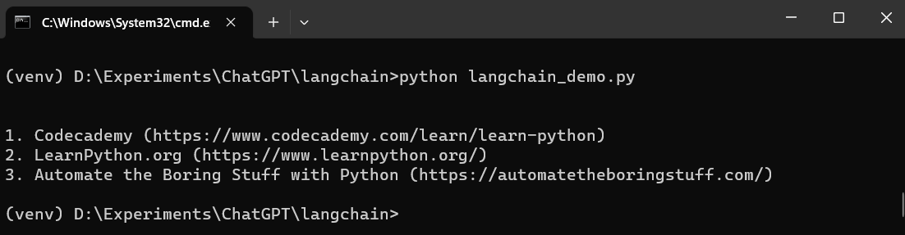
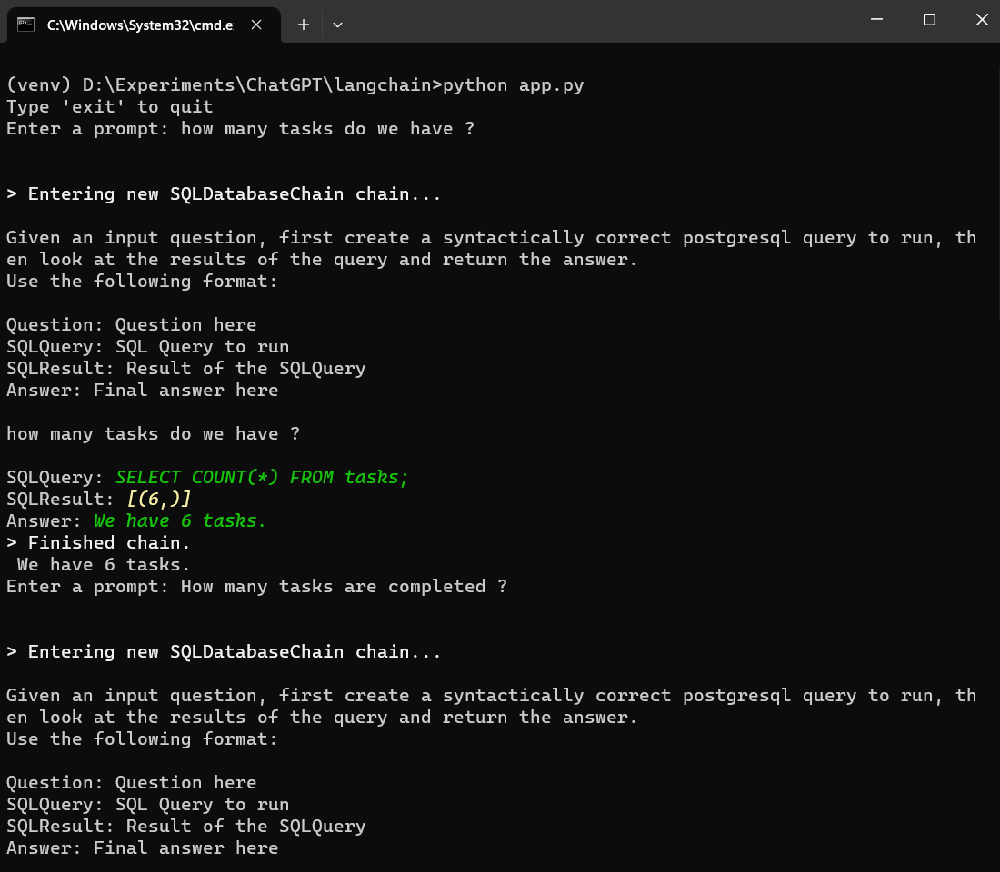
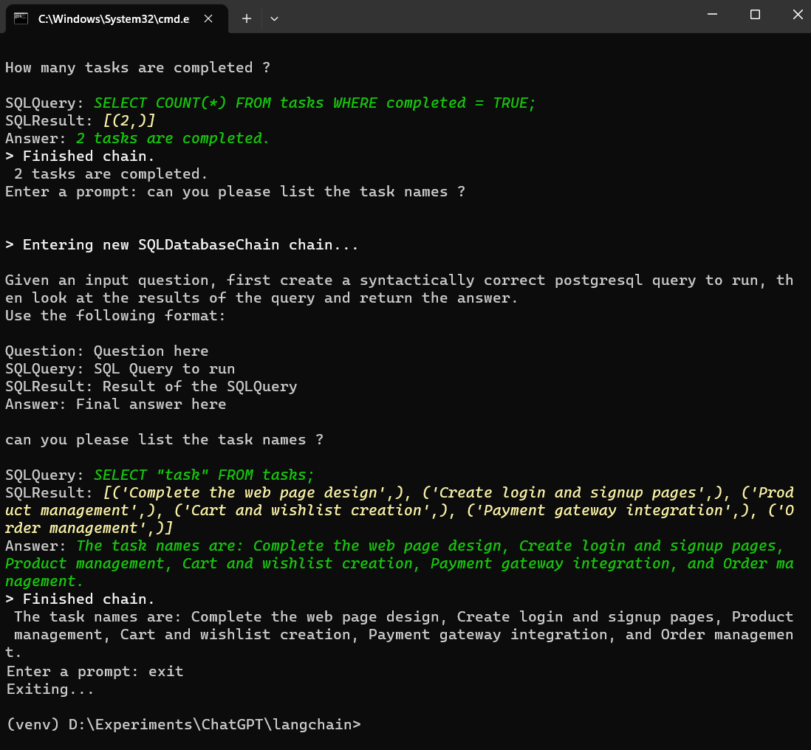

# SQLDatabaseChain LangChain Demo

This repository contains code for basics interaction with postgres database using SQLDatabaseChain. Also added examples for langchain demo to demonstrate the use of langchain simple llm calls and running chains using templates. 


## Install the dependencies

- Create a new virtual environment
```
python -m venv venv
source venv/bin/activate #for ubuntu
venv/Scripts/activate #for windows
```
- Install `langchain`,`openai`, `python-environ` and `psycopg2` libraries using pip.
```
pip install langchain openai python-environ psycopg2
```

## LangChain Simple LLM Demo

### Source code

```py
from langchain.llms import OpenAI

# Accessing the OPENAI KEY
import environ
env = environ.Env()
environ.Env.read_env()
API_KEY = env('OPENAI_API_KEY')

# Simple LLM call Using LangChain
llm = OpenAI(model_name="text-davinci-003", openai_api_key=API_KEY)
question = "Which language is used to create chatgpt ?"
print(question, llm(question))

```

### Output




## LangChain Chain and Templates Demo

### Source code

```py
from langchain.llms import OpenAI

# Accessing the OPENAI KEY
import environ
env = environ.Env()
environ.Env.read_env()
API_KEY = env('OPENAI_API_KEY')

# Creating a prompt template and running the LLM chain
from langchain import PromptTemplate, LLMChain
template = "What are the top {n} resources to learn {language} programming?"
prompt = PromptTemplate(template=template,input_variables=['n','language'])
chain = LLMChain(llm=llm,prompt=prompt)
input = {'n':3,'language':'Python'}
print(chain.run(input))

```

### Output



## SQLDatabaseChain Demo

- [Download](https://www.enterprisedb.com/downloads/postgres-postgresql-downloads) and install postgres in your machine.
- Create a database called tasks in pgAdmin4
- Run the `db.py` file to create the database table tasks and insert values in it. 

```
python db.py
```
- Run the `app.py` file to run the SQL Database Chain. 
```
python app.py
```

### Output


